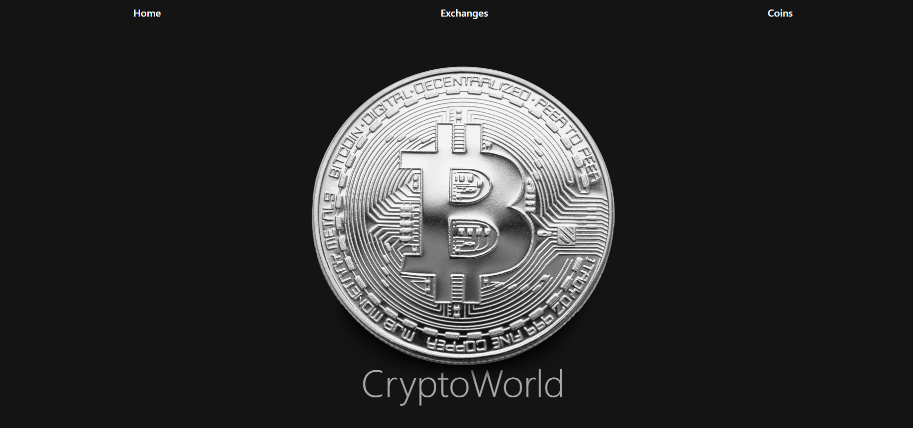
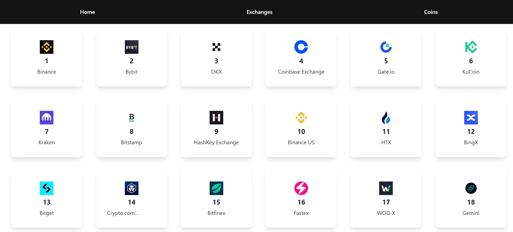
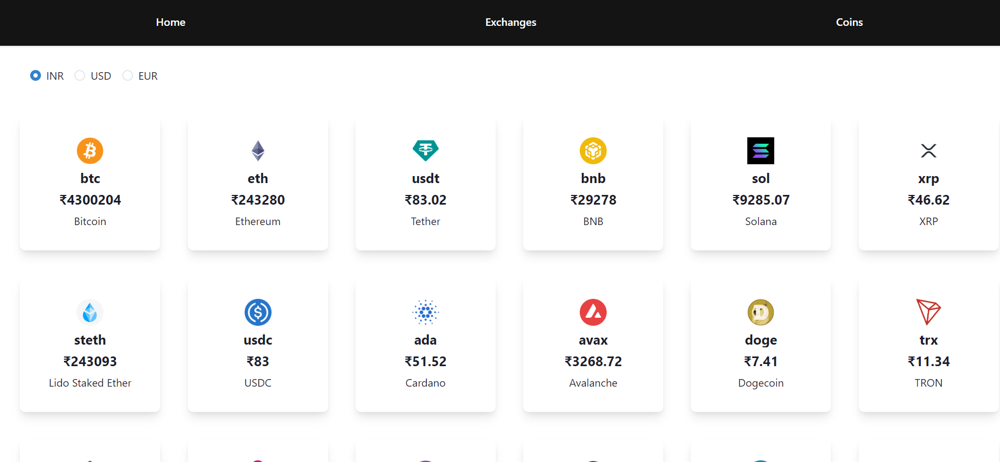
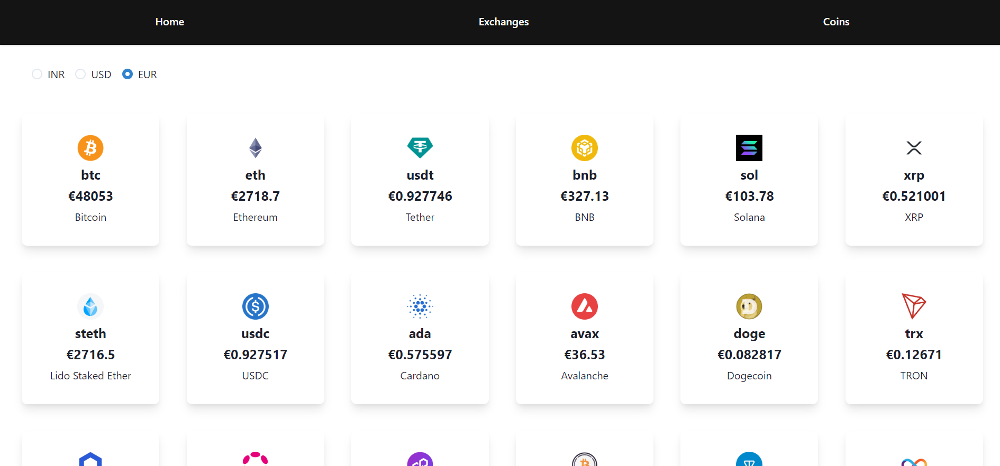
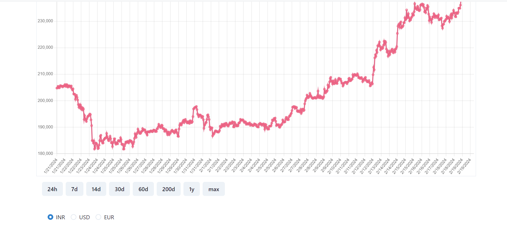
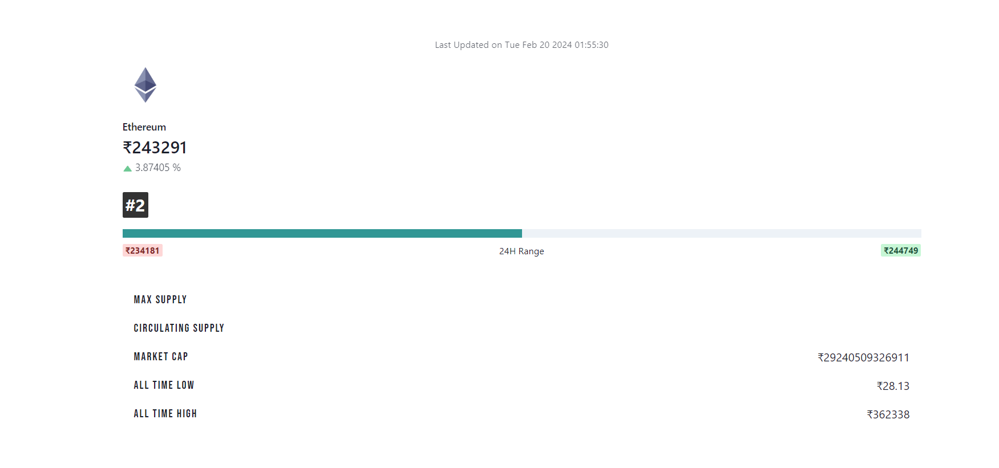

<h1 align="center" id="title">CryptoWorld</h1>

<p align="center"></p>

<h2>🚀 Demo</h2>

[https://ad-cryptoworld.netlify.app/](https://ad-cryptoworld.netlify.app/)
<h3>PS:If the page is showing error,please refresh it after a few minutes</h3>

<h2>Project Screenshots:</h2>


<p><h4>The home page of the website</h4></p>


<p><h4>The Exchanges Page, where you can find all the top cryptocurrencies trading platforms according to your country </h4></p>


<p><h4>The Coins Page, where you can find all the cryptocurrencies and their current price</h4></p>


<p><h4>Showing the value of cryptocurrencies in euros.</h4></p>


<p><h4>The Coin Page, where you can see the price graph of the particular cryptocurrency. You can also customise the duration of the graph and the currency as well for the given cryptocurrency</h4></p>


<p><h4> Real-time data of a particular Coin showed on its page just below the graph</h4></p>

<h2>🛠️ Installation Steps:</h2>

<p>1. Clone this repository</p>

```
git clone https://github.com/AbhiD1678/CryptoWorld.git
```

<p>2. Navigate to the project directory</p>

```
cd CryptoWorld
```

<p>3. Install dependencies</p>

```
npm install
```

<p>4. Start the development server</p>

```
npm start
```

  
  
<h2>💻 Built with</h2>

Technologies used in the project:

*   React
*   Chakra Ui
*   Chartjs
*   React-Router-Dom
*   Axios
*   Framer-Motion

<h2>🛡️ License:</h2>

This project is licensed under the Mit License
